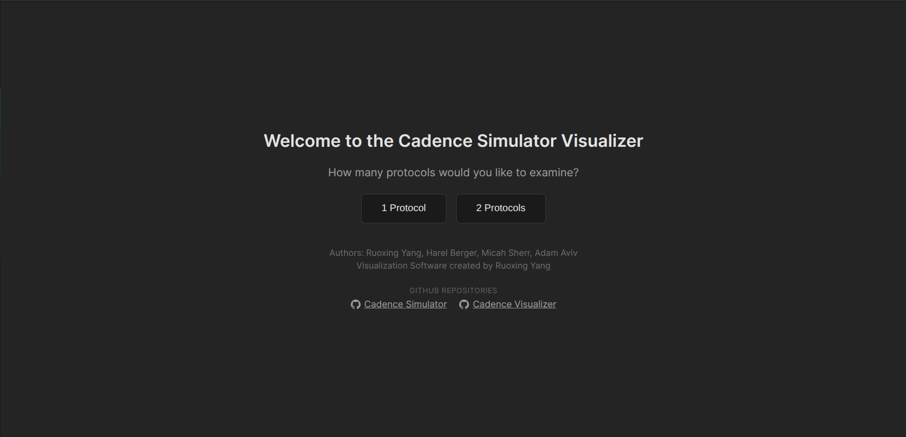
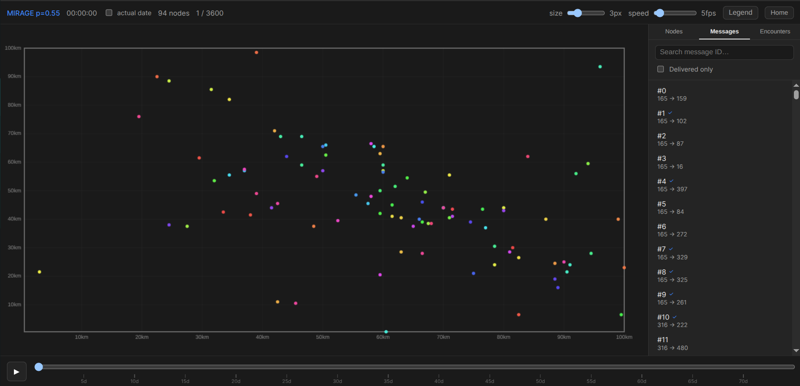
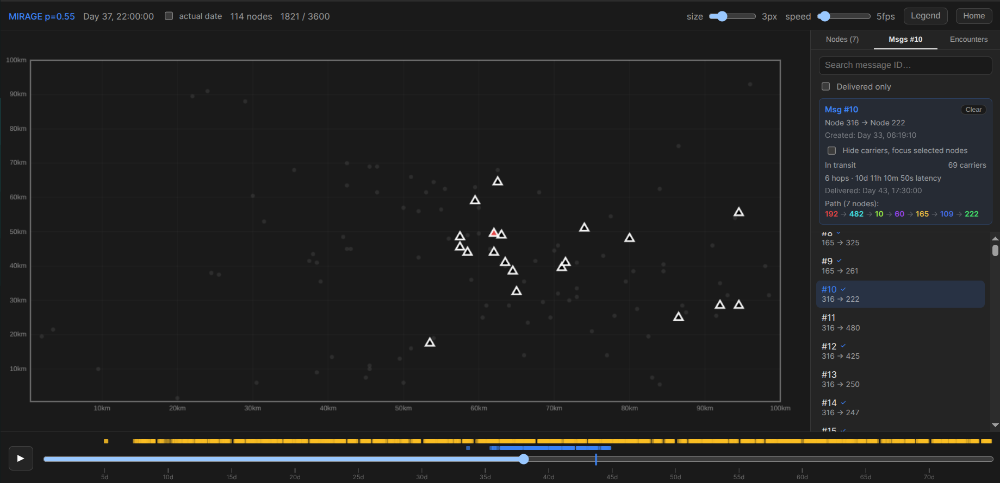
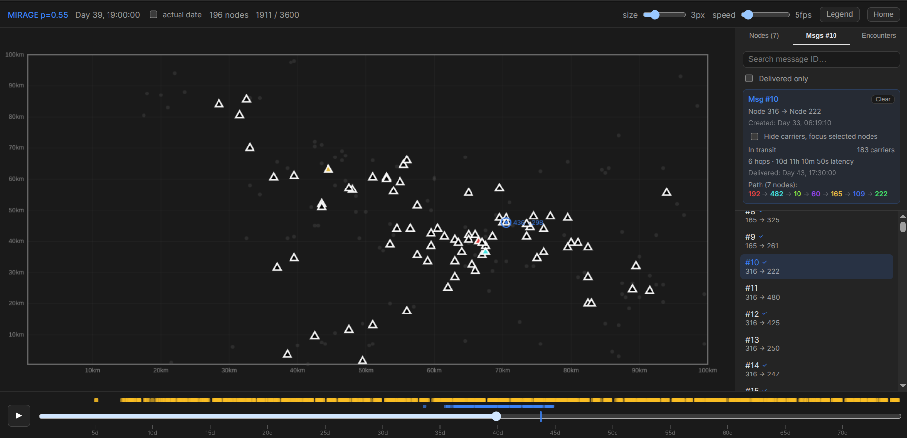
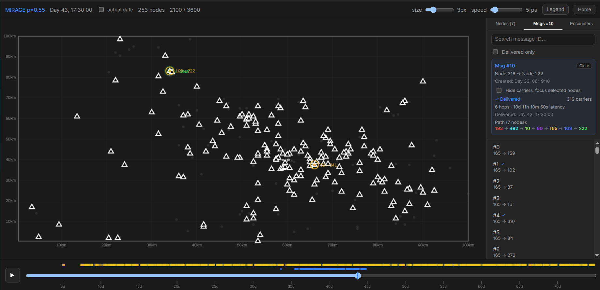
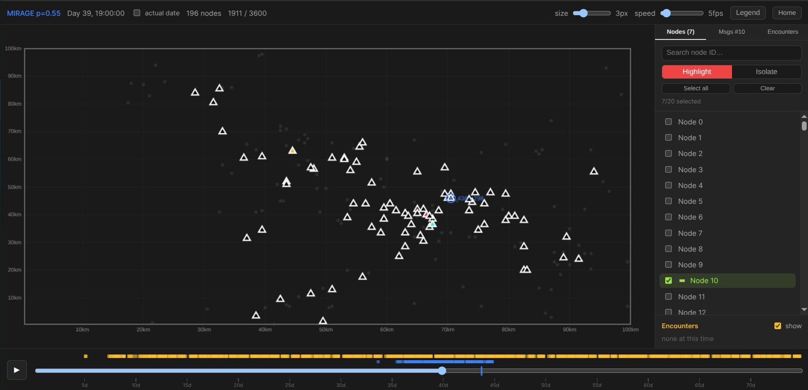
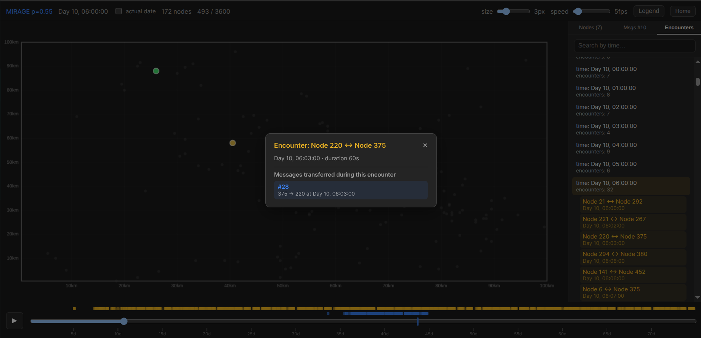
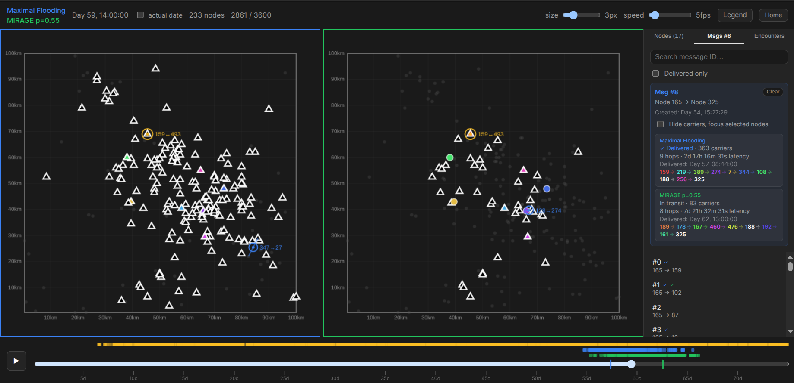
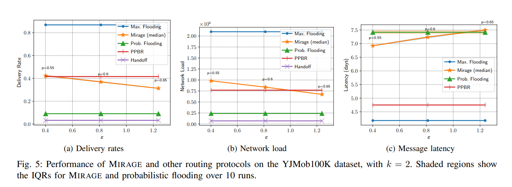

# Introduction

When a user sends a direct message on a platform such as Instagram, this message first travels from the sender's device to a centralized server system maintained by the platform provider (Instagram/Meta). This centralized server system then delivers the message to the designated recipient's device. What happens when this centralized server system is unavailable or untrustworthy?

Common digital communication systems, such as messaging platforms or email, take advantage of centralized computing infrastructure (such as business servers and data centers). This structure is vulnerable to surveillance and censorship threats from government agents as well as the companies that manage the computing infrastructure. Furthermore, natural disasters such as floods may also affect the reliability of centralized infrastructure.

To address these concerns, alternative systems leverage human-to-human links to communicate messages. These links are established when individual devices, such as cellphones, come within proximity to each other, allowing messages to flow through protocols such as WIFI or Bluetooth. These decentralized, human networks, called **HumaNets**, bypass centralized infrastructure and its associated vulnerabilities.

# Consideration Factors

HumaNet message routing protocols are judged by the following measures:

- **Message Delivery Effectiveness** - how many messages reach their destination?

  Protocols should aim to deliver a high number of messages to their destination.

- **Network Congestion** - how many message copies exist within the network?

  Protocols should aim for low network congestion to reduce network resource costs.

- **Message Delivery Efficiency** - how many messages are delivered for a given amount of network load?

  Protocols should aim to be deliver as many messages as possible while using the least amount of resources.

- **Message Delivery Time Latency** - how much time does it take for messages to reach their destination?

  Protocols should aim to deliver messages in a short amount of time.

- **Message Delivery Hops Latency** - how many message transfers (hops) does it take for messages to reach their destination?

  Protocols should aim to deliver messages with a small number of message transfers.

- **Privacy** - how does involvement in the protocol reveal sensitive information about protocol participants?

  Protocols should aim to preserve participant privacy.

# 3. Routing Protocols

This study will investigate five HumaNet routing protocols:

**Standard Protocols:**

- **Maximal Flooding**

  Each user copies all stored messages to all encountered users.

- **Probabilistic Flooding**

  Each user will copy each stored message with ½ probability to an encountered user. When such a transfer occurs, the original user will delete the locally stored message with ⅘ probability.

- **Handoff**

  Each user will transfer each stored message to the first encountered user, then delete all local copies.

**Geographic Mobility Profile-Based Protocols:**

These special protocols take advantage of user mobility patterns to inform message routing decisions and increase message delivery efficiency.

- **Probabilistic Profile-Based Routing (PPBR)**

  In PPBR, each user computes a private location profile based on their historic movement patterns. The user then uses this profile to silently determine whether to accept a message for forwarding. Generally, the user will accept a message if its mobility patterns indicate the user will visit the geographic destination of the message with high probability.

- **MIRAGE**

  In MIRAGE, each user constructs a private mobility profile by computing their top 2 most frequently visited geographic districts based on their historic movement patterns. Precise statistical noise is then added to this private mobility profile to hide the user's true movement partially and to grant the user plausible deniability while preserving the profile's utility. Users determine whether to accept a message for forwarding by checking for the presence of the message destination district within their noisy private mobility profile. Generally, this leads users to accept messages destined for districts they frequently visit.

# 4. Simulator Operation Instructions

Access the simulator at [link]. You have the option to focus on a single protocol or compare two protocols in action simultaneously.

The visualizer displays all network participants present in the dataset as circular nodes on the central map. You can adjust the size of the nodes and the speed of the animation using the options in the top bar. You may manually jump to any point in time by dragging the bottom timeline scrubber.

You may focus on a specific message by selecting it in the message menu. Messages that eventually reach the designated recipient are marked by a check. Message sender-receiver pairs, as well as origination time, are randomly selected.

Blue markers on the bottom timeline as well as the central map indicate message transfer events, where a message is passed from one node to another during an encounter between the two nodes. Nodes that currently carry a copy of the message are marked as triangles. Nodes that participate in the ultimate delivery path from the original sender to the final recipient are colored. All irrelevant nodes are grayed out when a message is in focus.

The event where a message reaches its intended recipient is marked by a line on the bottom timeline as well as a green "dest" marker on the map.

You also have the option to manually select nodes to focus on. Selected nodes are colored.

You may investigate specific 2-node encounters using the encounters menu. Encounters are sorted by time.

Controls work similarly in the two-protocol use case. Protocol 2 is marked as green instead of blue.

**Notes:**

The simulator uses YJMob100K, an anonymized real-world human mobility dataset that describes the movements of individuals in an unspecified city in Japan over 75 days. Locations were collected using mobile phone location data.

# 5. Metrics

