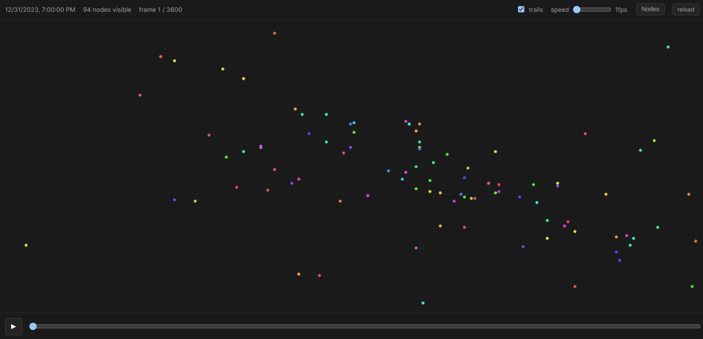
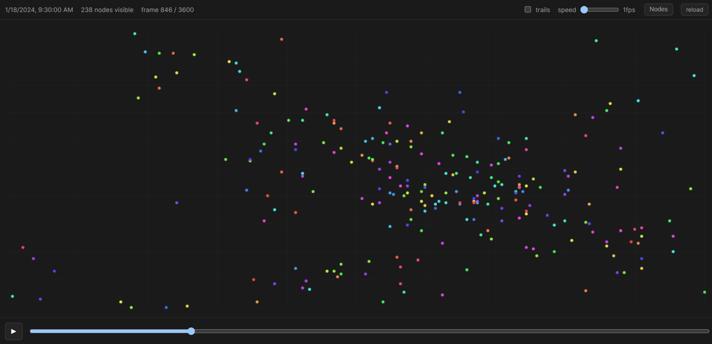
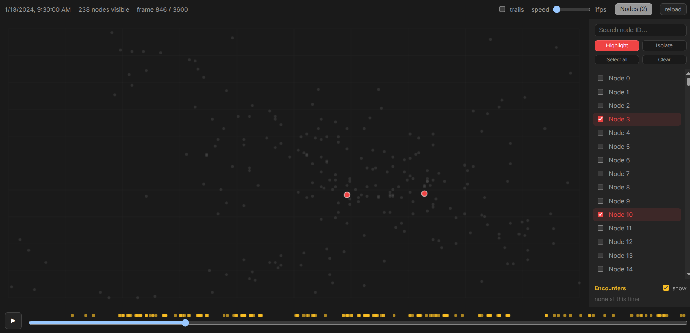
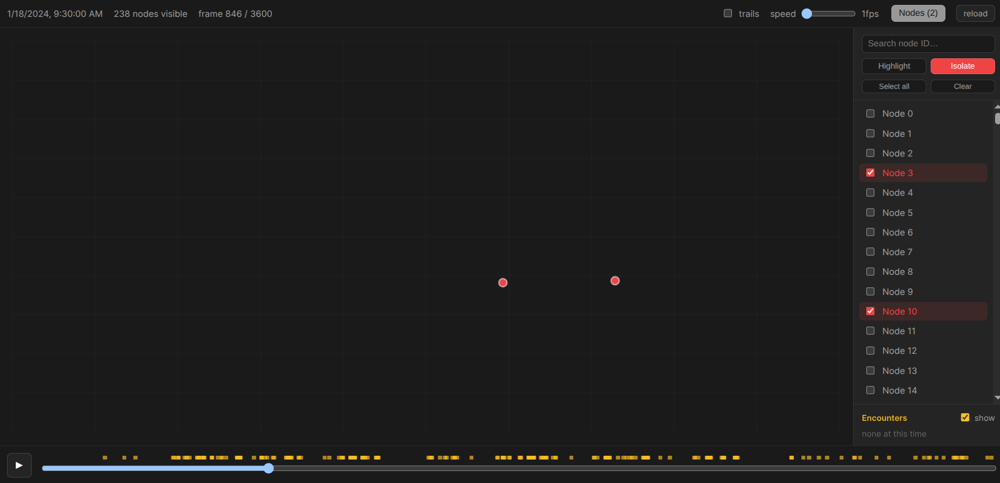
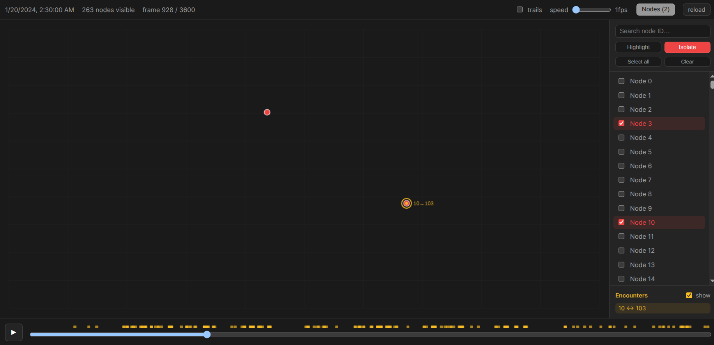
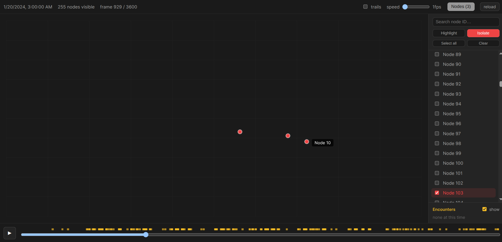
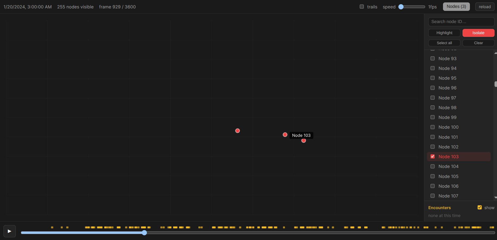

# Cadence Visualizer

The Cadence Visualizer is a visualization tool created to accompany [the Cadence Simulator](https://github.com/GUSecLab/cadence). The Cadence Simulator provides a framework to test decentralized message passing algorithms on mobility datasets.The Cadence Visualizer allows users to visualize node movement, node interactions, message movement, as well as algorithm-specific behavior such as buffer status, across the virtual geographical environment over time. 


## Setup

**1. Export frames from your database**

Copy the SQLite database, generated by the Cadence simulator, into `db/`, then run:

```bash
python export_frames.py --db db/your_database.db --out frames/frames.jsonl.gz
```

Both `db/` and `frames/` are gitignored — create them and populate them manually. This is because the database and frames files are often very large.

**2. Run the visualizer**

```bash
cd app
npm install
npm run dev
```

Open `http://localhost:5173`, then select and load a `frames/frames.jsonl.gz` file.

## Cadence Visualizer Demo

This is the initial starting frame displaying all nodes. Different nodes are indicated by different colors.



An alternate frame from a later timestamp displaying all nodes. Nodes are in different positions after moving over time. 



Users have the option to view animated node movement by clicking the play button in the bottom left corner and specifying a frame rate. 

The bottom time scrubber can also be used to manually navigate between timestamps. Top right menu indicates current timestamp as well as number of active nodes (not all nodes are visible/active during all time frames due to inconsistent data-polling - not all nodes have data for all time frames).

Clicking on the top right "nodes" button opens the nodes menu. This menu contains a list of all nodes present in the dataset and allows the user to focus on a subset of nodes.

In this screenshot, nodes 3 and 10 are selected and therefore highlighted in red. 



Users can isolate selected nodes, which simply hides all other nodes.



In this frame, node 10 encounters 103. This encounter event is marked by a yellow outline on the relevant node. Encounters for selected nodes are displayed as yellow tick-marks on the bottom time scrubber. Click on a yellow tick-mark to jump to the specified encounter.



Immediately following the encounter, node 10 and node 103 continue moving and separate from each other. At any point, clicking on a node will reveal its id. 



